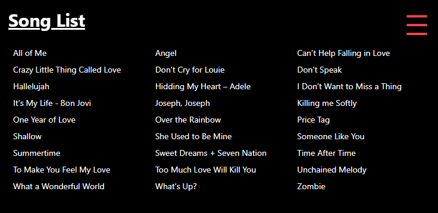
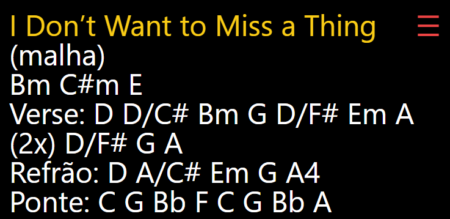

# guitar_helper
Guitar Helper to display chords for songs defined in a CSV file.  

Done this as I needed to have the songs in my Google Drive as Google Sheet format, but to visualize when performing, I need a decent display to see on my mobile phone.

## TL;DR
You can see the final result in here -> http://guitar.afonsodev.eu/  
BTW: done with SvelteJs




### Step 1 - Create a CSV (comma separated values) file containing two columns: Song and Chords
Add songs to your file.   
Example:
```csv
Song,Chords
"Have You Ever Seen The Rain","Intro: Am F C, Verses: C G C, Chorus: F G C"
```
Save it in your dropbox (or any other cloud accessible storage) and get the link. 

### Step 2 - Clone this repo and install packages
Clone this repo and 
```
$ cp .env.example to .env
$ npm install
```

### Step 3 - Set your CSV file link in .env file
Edit .env and set the CSV file link. It will be downloaded and parsed

### Step 4 - Build the webpage
Web page is built using handlebars and tailwind
```
$ npm run build:all
```

### Step 5 - Deploy folder public_html
Copy the contents of public_html folder to a webserver  
For me, I'm running ```npm run deploy``` on my server

### Step 6 - Done!
Open your site url and enjoy the Guitar Helper

## Sync Songs Updates
To update the build:
1. Run ```npm run build:all```
2. Deploy ```npm run deploy```
